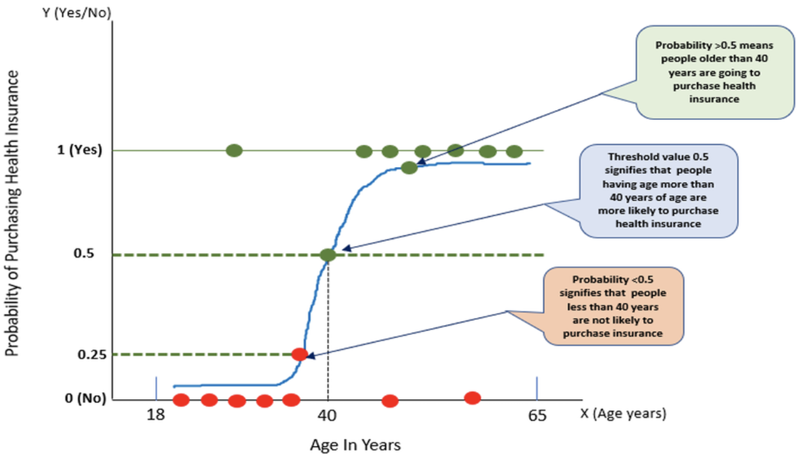

# Titanic-Dataset-Logistic-Regression

In this repository, logistic regression will be employed to analyze the Titanic Dataset sourced from Kaggle.

[Kaggle (Dataset)](https://www.kaggle.com/competitions/titanic)

## Data

- PassengerID: type should be integers

- Survived: survived or not

- Pclass: class of Travel of every passenger

- Name: the name of the passenger

- Sex: gender

- Age: age of passengers

- SibSp: No. of siblings/spouse aboard

- Parch: No. of parent/child aboard

- Ticket: Ticket number

- Fare: what Prices they paid

- Cabin: cabin number

- Embarked: the port in which a passenger has embarked.

  - C: Cherbourg , S: Southampton , Q: Queenstown

## Logistic Regression

**Logistic regression** is a supervised machine learning algorithm mainly used for classification tasks where the goal is to predict the probability that an instance of belonging to a given class. 

This type of statistical model (also known as logit model) is often used for classification and predictive analytics. Logistic regression estimates the probability of an event occurring, such as voted or didn’t vote, based on a given dataset of independent variables. Since the outcome is a probability, the dependent variable is bounded between 0 and 1. 

 It’s referred to as regression because it takes the output of the linear regression function as input and uses a **sigmoid function** to estimate the probability for the given class. 

The logistic regression model transforms the linear regression function continuous value output into categorical value output using a sigmoid function, which maps any real-valued set of independent variables input into a value between 0 and 1.




**The loss function** for logistic regression is **Log Loss**, which is defined as follows:

$$\text{LogLoss} = -\frac{1}{N} \sum_{i=1}^{N} \left( y_i \log(p_i) + (1 - y_i) \log(1 - p_i) \right) $$

Here:
- $(N)$ is the number of samples in the dataset.
- $(y_i)$ is the true class label for the \(i\)-th sample (0 or 1).
- $(p_i)$ is the predicted probability that the \(i\)-th sample belongs to class 1.

Log Loss penalizes models based on the difference between the predicted probabilities and the true labels. It measures how well the predicted probabilities align with the actual binary outcomes. Lower Log Loss values indicate better model performance.

**Regularization**

Regularization is extremely important in logistic regression modeling. Without regularization, the asymptotic nature of logistic regression would keep driving loss towards 0 in high dimensions. 

- L2 regularization
- Early stopping

**Metric**

 **Accuracy** is the fraction of predictions our model got right.

$$ {Accuracy} = \frac{\text{Number of Correct Predictions}}{\text{Total Number of Predictions}} $$

## Environment

Use the requirements file in this repo to create a new environment for this task. 

```Bash
pyenv local 3.11.3
python -m venv .venv
source .venv/bin/activate
pip install --upgrade pip
pip install -r requirements.txt
```

If you are working on Windows type the following commands in the PowerShell:

```sh
python -m venv .venv
.venv\Scripts\Activate.ps1
```

*Note: If there are errors during environment setup, try removing the versions from the failing packages in the requirements file.*
